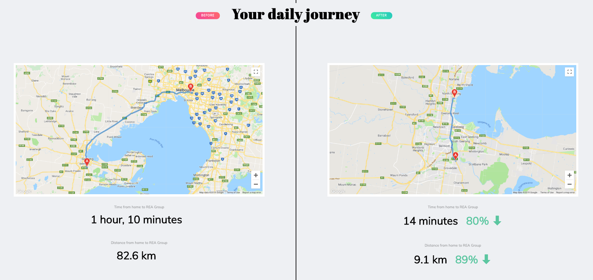
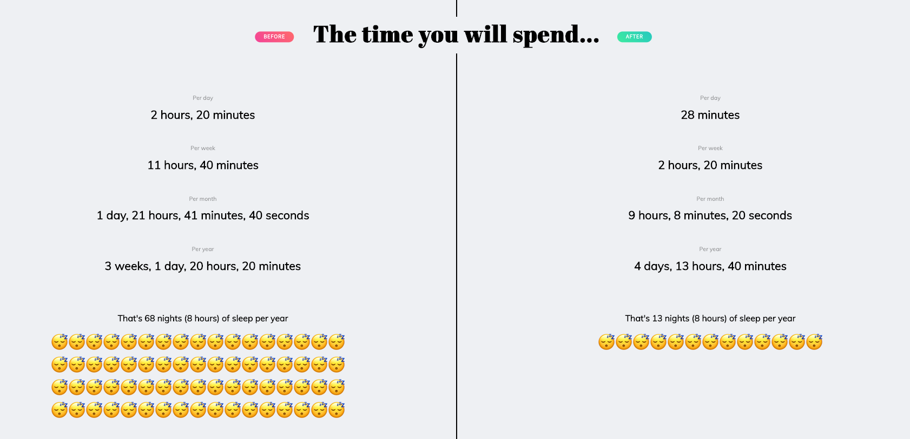
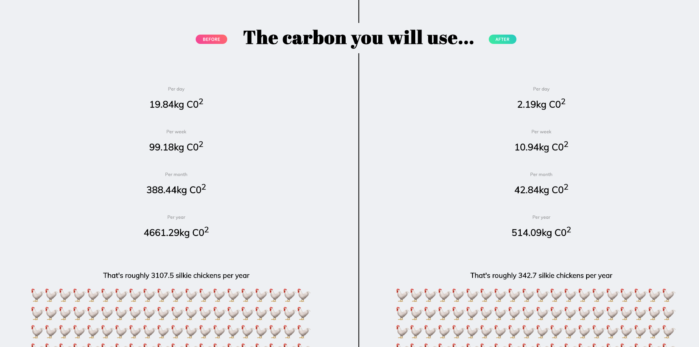

Another hack-day or REA.io project, this one on the theme of "MUDA" (waste). We thought we would combine this theme with our REA Group line of business, Spacely (Short Term and Shared Work Space in Australia).

Our idea was to highlight the amount of wasted time and Co2 consumed with your mode of transport each day to and from work, then suggest a co-working hub closer to your home, highlighting what you would save by doing so.

Entering your address would highlight both journeys, to work (REA Group) and to the nearest co-working space.

## Your Daily Journey

Next we highlighted how much time you could save and how much Co2 wasted. We of course measured this in standard units of:

- How many hours in nights of sleep you waste 
- How much Co2 you consume by scale of the average silkie chicken 

## Time wasted in number of sleeps

## Co2 Wasted in number of chickens

## Tech stack

The tech behind this project was React and Google Maps to serve the maps and pull the directions/distances to the nearest Spacely Hub.